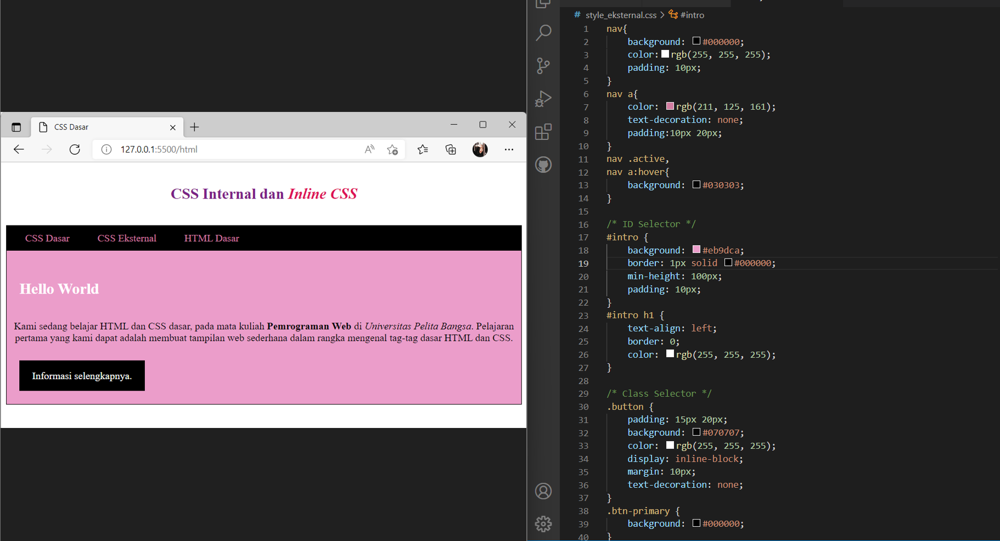

# PEMOGRAMAAN WEB

Diyan Arum Maheswari (312010133)

Teknik Informatika - UNIVERSITAS PELITA BANGSA
______________________________________________

## MEMBUAT DOKUMEN HTML

Pertama - tama disini saya akan membuat sebuah dokumen dasar Html seperti dibawah ini terlebih dahulu, untuk nantinya akan kita modifikasi sedikit.


Berikut codingan yang saya gunakan untuk membuat sebuah contoh dokumen seperti diatas.

```html
<!DOCTYPE html>
<html lang="en">
<head>
    <meta charset="UTF-8">
    <meta name="viewport" content="width=device-width, initial-scale=1.0">
    <title>CSS Dasar</title>
</head>
<body>
    <header>
        <h1>CSS Internal dan <i>Inline CSS</i></h1>
    </header>
    <nav>
        <a href="lab2_css_dasar.html">CSS Dasar</a>
        <a href="lab2_css_eksternal.html">CSS Eksternal</a>
        <a href="lab1_tag_dasar.html">HTML Dasar</a>
    </nav>
    <!-- CSS ID Selector -->
    <div id="intro">
        <h1>Hello World</h1>
        <p>Kami sedang belajar HTML dan CSS dasar, pada mata kuliah <b>Pemrograman
Web</b> di <i>Universitas Pelita Bangsa</i>. Pelajaran pertama yang kami dapat
adalah membuat tampilan web sederhana dalam rangka mengenal tag-tag dasar HTML
dan CSS.</p>
        <!-- CSS Class Selector -->
        <a class="button btn-primary" href="#intro">Informasi selengkapnya.</a>
    </div>
</body>
</html>
```

## MENDEKLARASIKAN CSS INTERNAL

Setelah membuat sebuah dokumen Html, selanjutnya akan saya tambahkan sebuah deklarasi CSS internal seperti dibawah ini.


Dan untuk dapat menambahkan sebuah deklarasi tersebut kalian bisa menggunakan codingan dibawah, yang bisa kalian tambahkan dibagian head dari codingan dokumen sebelumnya.

```html

<head>
        <title>CSS Dasar</title>
        <style>
            body {
                font-family:'Times New Roman', sans-serif;
             }
            header {
                min-height: 80px;
                border-bottom:1px solid #080808;
            }
            h1 {
                font-size: 24px;
                color: #7b2186;
                text-align: center;
                padding: 20px 10px;
            }
            h1 i {
                color:#dd1155;
            }
         </style>
    </head>

```

## MENAMBAHKAN INLINE CSS

Setelah menambahkan deklarasi internal seperti diatas, selanjutnya saya akan menambahkan sebuah Inline CSS pada deklarasi tersebut seperti dibawah ini.


Cara untuk menambahkan sebuah inline pada deklarasi sebelumnya kalian hanya perlu menambahkan sebuah tag < P > berikut pada sebuah awal kalimat yang diinginkan agar menampilkan sebuah warna yang kalian mau, disini saya memakai warna hitam dengan codingan sebagai berikut.

```html

 <p style="text-align: center; color: #030303;">
 
```

## MEMBUAT CSS EKSTERNAL

Langkah selanjutnya, disini saya akan membuat sebuah file baru terlebih dahulu dengan judul style_eksternal.css yang kemudian nantinya akan saya deklarasikan kembali seperti dibawah ini.

```css

nav{
    background: #000000;
    color:rgb(255, 255, 255);
    padding: 10px;
}
nav a{
    color: rgb(211, 125, 161);
    text-decoration: none;
    padding:10px 20px;
}
nav .active,
nav a:hover{
    background: #030303;
}

```
Selanjutnya, kembali pada Html dan kemudian kita tambahkan sebuah tag < link > untuk dapat merujuk ke file CSS yang sudah dibuat pada bagian <head> seperti ini.

```html

<head>
            <!-- menyisipkan css eksternal -->
            <link rel="stylesheet" href="style_eksternal.css" type="text/css">
        </head>

```

Setelah itu maka akan dihasilkan sebuah tampilan Html seperti dibawah ini.


## MENAMBAHKAN CSS SELECTOR

Langkah terakhir yaitu diakhiri dengan menambahkannya sebuah CSS Selector yang menggunakan ID dan Class Selector pada file style_eksternal.css sebelumnya.


Dan untuk dapat menambahkan sebuah CSS Selector maka kalian hanya perlu menambahkan kode berikut pada codingan di file style_eksternal.css seperti dibawah ini.

```CSS

/* ID Selector */
#intro {
    background: #eb9dca;
    border: 1px solid #000000;
    min-height: 100px;
    padding: 10px;
}
#intro h1 {
    text-align: left;
    border: 0;
    color: rgb(255, 255, 255);
}

/* Class Selector */
.button {
    padding: 15px 20px;
    background: #070707;
    color: rgb(255, 255, 255);
    display: inline-block;
    margin: 10px;
    text-decoration: none;
}
.btn-primary {
    background: #000000;
}

```
# PERTANYAAN DAN TUGAS

## 1. Lakukan eksperimen dengan mengubah dan menambah properti dan nilai pada kode CSS dengan mengacu pada CSS Cheat Sheet yang diberikan pada file terpisah dari modul ini.


____________________________________________________________________________________

## 2. Apa perbedaan pendeklarasian CSS elemen h1 {...} dengan #intro h1 {...}? berikan penjelasannya!

=> Mendeklarasi {h1} = semua elemen {h1} akan berubah oleh CSS

=> Mendeklarasi (#intro h1) = hanya elemen h1 dengan deklarasi (#intro h1) saja yang berubah karena ID itu unik
____________________________________________________________________________________

## 3. Apabila ada deklarasi CSS secara internal, lalu ditambahkan CSS eksternal dan inline CSS pada elemen yang sama. Deklarasi manakah yang akan ditampilkan pada browser? Berikan penjelasan dan contohnya!

Jika ketiganya di deklarasikan secara bersamaan maka yang muncul di browser hanyalah hasil deklarasian Inline CSS. Karena Inline memiliki prioritas terkuat dibandingkan dengan internal ataupun eksternal. 


Seperti yang bisa kalian lihat diatas, bahwa untuk masing-masing properti dari deklarasi diatas masing-masing berbeda, diantaranya yaitu:

1. Iternal = color:brown; text-align:right
2. Inline = color:cadetblue; text-align:center
3. Eksternal = color:darkolivegreen; text-align:justify

Dan deklarasi yang dimunculkan oleh browser adalah deklarasi Inline(color:cadetblue; text-align:center)
_____________________________________________________________________________________

## 4. Pada sebuah elemen HTML terdapat ID dan Class, apabila masing-masing selector tersebut terdapat deklarasi CSS, maka deklarasi manakah yang akan ditampilkan pada browser? Berikan penjelasan dan contohnya!

Yang akan ditampilkan pada bworser dari keduanya adalah ID. 


Seperti yang bisa kalian lihat ID memiliki properti {color:rgb(168, 106, 137); text-align:center} karena lebih unik dibandingkan CLASS.


# <P align="center"> THANK'S FOR YOUR ATTENTION GUYS! SEE YOU!
